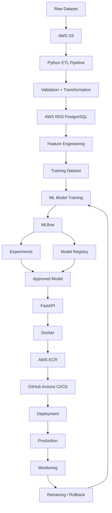
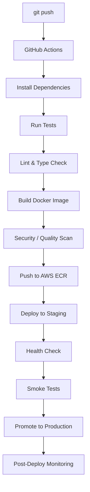
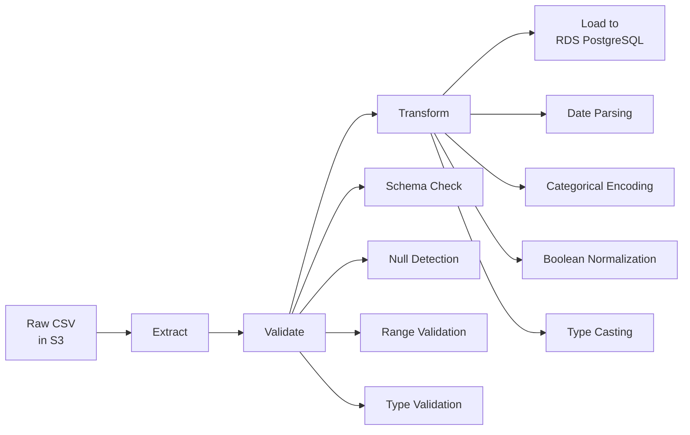
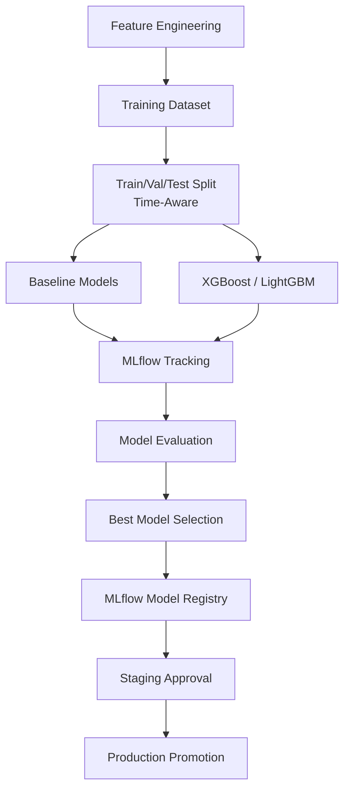
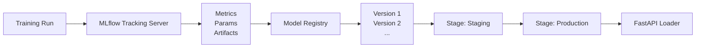
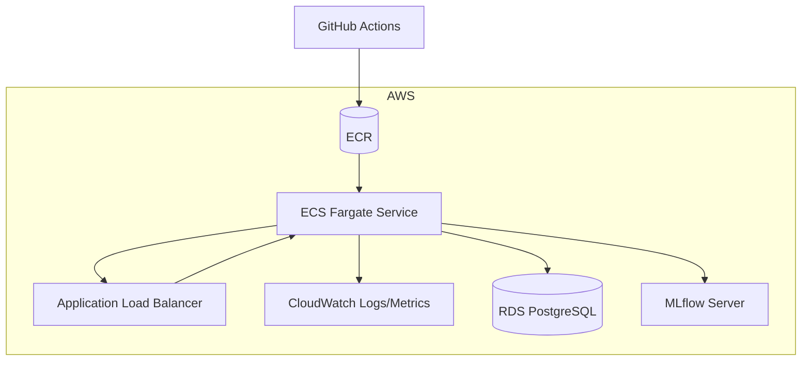

# Household Energy Consumption MLOps Pipeline

> An end-to-end MLOps project for household energy consumption prediction, focused on automated ML deployment, Docker containerization, MLflow model management, and CI/CD. The project is currently under active development, with the data ingestion and ETL pipeline completed as the first milestone.

---

## Project Overview

This project demonstrates a **production-oriented MLOps lifecycle** for predicting household energy consumption. Unlike typical ML projects that stop at model training, this system is designed around **automated deployment, continuous integration, containerization, and model governance** — the engineering practices required to run ML reliably in production.

The pipeline spans from raw data ingestion through to automated retraining, with each stage versioned, tested, and deployable.

---

## Project Objective

The primary goal is to build and showcase a complete **MLOps platform** covering:

1. **Data ingestion & ETL** — Reliable, validated data movement from source to feature store
2. **Feature engineering** — Reproducible feature generation and dataset creation
3. **Model training** — Experiment tracking, reproducibility, and model comparison
4. **MLflow experiment tracking** — Centralized metrics, parameters, and artifacts
5. **MLflow Model Registry** — Model versioning, staging, and approval workflows
6. **Docker containerization** — Consistent, portable model serving
7. **CI pipeline** — Automated testing, linting, and validation on every push
8. **Automated Docker image building** — Reproducible artifacts with versioned tags
9. **AWS ECR integration** — Secure, private container registry
10. **Automated deployment** — Zero-downtime releases with health verification
11. **Deployment health checks** — Automated validation before traffic routing
12. **Smoke testing** — Critical path verification post-deployment
13. **Rollback strategy** — Instant reversion on deployment failure
14. **Model/data/API monitoring** — Observability across the ML lifecycle
15. **Automated retraining** — Triggered by drift, performance decay, or schedule

---

## Current Status

| Component | Status |
|---|---|
| Dataset acquisition | ✅ Completed |
| AWS S3 raw data storage | ✅ Completed |
| ETL extraction | ✅ Completed |
| Data validation | ✅ Completed |
| Data transformation | ✅ Completed |
| PostgreSQL/RDS loading | ✅ Completed |
| Feature engineering | 🚧 In Progress |
| Model training | ⏳ Planned |
| MLflow experiment tracking | ⏳ Planned |
| MLflow Model Registry | ⏳ Planned |
| FastAPI model serving | ⏳ Planned |
| Docker containerization | ⏳ Planned |
| AWS ECR integration | ⏳ Planned |
| GitHub Actions CI | ⏳ Planned |
| Automated CD | ⏳ Planned |
| Production deployment | ⏳ Planned |
| Monitoring & alerting | ⏳ Planned |
| Automated retraining | ⏳ Planned |

> **Legend**: ✅ Completed · 🚧 In Progress · ⏳ Planned

---

## Architecture

### Target End-to-End Architecture



---

## Project Roadmap

### Phase 1 — Data Engineering ✅ **Completed**
- [x] Raw dataset storage in AWS S3
- [x] Python ETL pipeline (extract → validate → transform → load)
- [x] Data validation (schema, nulls, ranges, types)
- [x] Data transformation (date parsing, categorical encoding, boolean handling)
- [x] Load processed data into AWS RDS PostgreSQL

### Phase 2 — Feature Engineering 🚧 **In Progress**
- [ ] Time-series feature generation (lags, rolling windows, calendar features)
- [ ] Aggregation features (household-level, temporal)
- [ ] Train/validation/test split strategy (time-aware)
- [ ] Feature store integration (planned: PostgreSQL-backed)

### Phase 3 — Machine Learning ⏳ **Planned**
- [ ] Baseline model (linear regression, statistical benchmarks)
- [ ] Gradient boosting (XGBoost / LightGBM)
- [ ] Hyperparameter optimization (Optuna / MLflow)
- [ ] Evaluation metrics (MAE, RMSE, MAPE, R²)
- [ ] Reproducibility (seeds, environment pinning, data versioning)

### Phase 4 — MLflow Integration ⏳ **Planned**
- [ ] Experiment tracking (metrics, params, tags, artifacts)
- [ ] Model signature and input example logging
- [ ] Model Registry with versioning
- [ ] Staging/Production model transitions
- [ ] Model approval workflow

### Phase 5 — Model Serving ⏳ **Planned**
- [ ] FastAPI prediction endpoint (`/predict`, `/health`, `/model-info`)
- [ ] Model loading from MLflow Model Registry (by stage/version)
- [ ] Request validation and response schema
- [ ] Batch and single prediction support

### Phase 6 — Docker Containerization ⏳ **Planned**
- [ ] Multi-stage Dockerfile (build → runtime)
- [ ] Non-root user, minimal base image
- [ ] Health check endpoint integration
- [ ] Local container testing (`docker compose up`)
- [ ] Image versioning (semver + git SHA)

### Phase 7 — CI/CD Pipeline ⏳ **Planned** *(Major Project Goal)*



**Pipeline stages:**
1. **CI** — Dependency install, unit/integration tests, linting (Ruff), type checking (mypy)
2. **Build** — Multi-arch Docker build, SBOM generation, vulnerability scan (Trivy)
3. **Push** — Tagged image to AWS ECR with immutable tags
4. **Deploy** — Blue/green or rolling deployment to target environment
5. **Verify** — Health endpoint, smoke tests, metric baseline comparison
6. **Rollback** — Automated on health check failure

### Phase 8 — Monitoring & Automation ⏳ **Planned**
- [ ] API latency, error rate, throughput (CloudWatch / Prometheus)
- [ ] Model performance monitoring (prediction drift, accuracy decay)
- [ ] Data drift detection (feature distribution shifts)
- [ ] Deployment health dashboards
- [ ] Automated rollback on SLO breach
- [ ] Scheduled / drift-triggered retraining pipeline

---

## Technology Stack

| Category | Technologies |
|---|---|
| **Language** | Python 3.11+ |
| **Data Engineering** | Pandas, PostgreSQL, psycopg2, SQLAlchemy |
| **Cloud Storage** | AWS S3, AWS RDS (PostgreSQL) |
| **ML Training** | Scikit-learn, XGBoost / LightGBM, Optuna |
| **MLOps** | MLflow (tracking + registry) |
| **Model Serving** | FastAPI, Uvicorn, Pydantic |
| **Containerization** | Docker, Docker Compose |
| **Registry** | AWS ECR |
| **CI/CD** | GitHub Actions |
| **Testing** | pytest, pytest-cov |
| **Code Quality** | Ruff, mypy |
| **Infrastructure** | AWS (ECS/Fargate or EC2 for deployment) |

> **Note**: Only the Data Engineering stack (Python, Pandas, AWS S3, AWS RDS PostgreSQL) is currently implemented. Remaining components are planned.

---

## Current ETL Pipeline

### ETL Architecture



### Data Flow

1. **Source**: UCI Household Power Consumption dataset (or similar) stored as raw CSV in **AWS S3**
2. **Extract**: Python script downloads and reads raw data using `boto3` + `pandas`
3. **Validate**: 
   - Column presence and order
   - Data type compliance
   - Null / missing value thresholds
   - Value range checks (e.g., power ≥ 0)
   - Timestamp continuity
4. **Transform**:
   - Parse `Date` + `Time` → timezone-aware `datetime` index
   - Convert numeric columns to appropriate dtypes (`float32`, `int16`)
   - Encode categorical variables (if any)
   - Normalize boolean-like columns (`0/1` → `bool`)
   - Handle missing values (interpolation / forward-fill for time series)
5. **Load**: Upsert into **AWS RDS PostgreSQL** with partitioning by time (monthly)

### Key Implementation Details

- **Idempotent loads**: Pipeline can be re-run safely using `ON CONFLICT` upserts
- **Checkpointing**: Progress tracked in a control table to resume interrupted runs
- **Logging**: Structured JSON logs for observability
- **Configuration**: All connection parameters via environment variables (see [Environment Variables](#environment-variables--aws-configuration))

---

## Project Structure

```text
household-energy-mlops/
│
├── data/                          # (planned) Data versioning / DVC
├── etl/                           # ✅ Implemented
│   ├── extract/
│   ├── validate/
│   ├── transform/
│   ├── load/
│   ├── pipeline.py                # Main orchestration
│   └── config.py                  # ETL configuration
├── tests/                         # ✅ Unit tests for ETL
│   ├── test_extract.py
│   ├── test_validate.py
│   ├── test_transform.py
│   └── test_load.py
├── config/                        # ✅ Configuration files
│   ├── etl_config.yaml
│   └── database.yaml
├── requirements.txt               # ✅ Current dependencies
├── README.md                      # This file
│
├── ml/                            # (planned) ML Pipeline
│   ├── training/
│   ├── evaluation/
│   └── inference/
│
├── api/                           # (planned) FastAPI Application
│   ├── main.py
│   ├── routes/
│   ├── schemas/
│   └── model_loader.py
│
├── docker/                        # (planned) Docker Configuration
│   ├── Dockerfile
│   ├── docker-compose.yml
│   └── .dockerignore
│
├── .github/                       # (planned) CI/CD
│   └── workflows/
│       ├── ci.yml
│       ├── cd-staging.yml
│       └── cd-production.yml
│
└── monitoring/                    # (planned) Observability
    ├── dashboards/
    ├── alerts/
    └── drift_detection/
```

> **Note**: Only `etl/`, `tests/`, `config/`, `requirements.txt`, and this `README.md` exist currently. All other directories are planned and marked accordingly.

---

## Setup Instructions

### Prerequisites

- Python 3.11+
- AWS CLI configured with credentials for S3 and RDS access
- PostgreSQL client (`psql`) for database verification
- Docker (for future containerization steps)

### Installation

```bash
# Clone the repository
git clone https://github.com/<your-username>/household-energy-mlops.git
cd household-energy-mlops

# Create virtual environment
python -m venv .venv
source .venv/bin/activate  # Windows: .venv\Scripts\activate

# Install dependencies
pip install -r requirements.txt
```

---

## Environment Variables / AWS Configuration

All sensitive and environment-specific configuration is managed via environment variables. Create a `.env` file (not committed) or export in your shell:

```bash
# AWS
AWS_REGION=us-east-1
AWS_ACCESS_KEY_ID=***
AWS_SECRET_ACCESS_KEY=***
AWS_S3_BUCKET=your-raw-data-bucket
AWS_S3_KEY=raw/household_power_consumption.csv

# RDS PostgreSQL
RDS_HOST=your-db-instance.xxxxxxxx.us-east-1.rds.amazonaws.com
RDS_PORT=5432
RDS_DATABASE=energy_db
RDS_USERNAME=***
RDS_PASSWORD=***

# ETL
ETL_BATCH_SIZE=10000
ETL_LOG_LEVEL=INFO
```

> **Security**: Never commit `.env` or credentials. Use GitHub Actions secrets for CI/CD.

---

## Running the ETL Pipeline

```bash
# Run full pipeline
python -m etl.pipeline

# Run individual stages (for development)
python -m etl.extract
python -m etl.validate
python -m etl.transform
python -m etl.load

# With custom config
ETL_CONFIG_PATH=config/etl_config.yaml python -m etl.pipeline
```

**Expected output**: Processed data loaded into `energy_consumption` table in RDS with schema:

| Column | Type | Description |
|---|---|---|
| `timestamp` | `TIMESTAMPTZ` | Primary key, timezone-aware |
| `global_active_power` | `FLOAT` | kW |
| `global_reactive_power` | `FLOAT` | kW |
| `voltage` | `FLOAT` | V |
| `global_intensity` | `FLOAT` | A |
| `sub_metering_1` | `FLOAT` | Wh |
| `sub_metering_2` | `FLOAT` | Wh |
| `sub_metering_3` | `FLOAT` | Wh |

---

## Database Configuration

**Target**: AWS RDS PostgreSQL 15+

**Table**: `energy_consumption` (partitioned by month on `timestamp`)

**Indexes**:
- Primary key: `(timestamp)`
- BRIN index on `timestamp` for time-range queries

**Connection pooling**: Use PgBouncer (planned) for production workloads.

---

## Testing

```bash
# Run all tests
pytest

# Run with coverage
pytest --cov=etl --cov-report=term-missing

# Run specific module
pytest tests/test_validate.py -v

# Lint
ruff check .

# Type check (planned)
mypy etl/
```

Current test coverage targets ETL validation and transformation logic.

---

## Planned ML Pipeline

The ML pipeline will follow this flow:



**Key principles**:
- Time-series split (no random shuffle)
- Walk-forward validation for robustness
- All experiments logged to MLflow with data version hash
- Model signature and input example stored for serving compatibility

---

## Planned MLflow Integration



**Components**:
- **Tracking Server**: Self-hosted on EC2 or AWS-managed (planned)
- **Artifact Store**: S3 bucket for models, plots, datasets
- **Backend Store**: PostgreSQL (separate from feature store)
- **Registry Webhooks**: Trigger CI/CD on model stage transition

---

## Planned Docker Architecture

```dockerfile
# Multi-stage build (planned)
# Stage 1: Builder
FROM python:3.11-slim AS builder
WORKDIR /app
COPY requirements.txt .
RUN pip install --user -r requirements.txt

# Stage 2: Runtime
FROM python:3.11-slim
WORKDIR /app
COPY --from=builder /root/.local /root/.local
COPY api/ ./api/
COPY ml/ ./ml/
ENV PATH=/root/.local/bin:$PATH
EXPOSE 8000
HEALTHCHECK CMD curl -f http://localhost:8000/health || exit 1
CMD ["uvicorn", "api.main:app", "--host", "0.0.0.0", "--port", "8000"]
```

**Image tagging**: `{semver}-{git-sha}` (e.g., `v1.2.0-a1b2c3d`)

---

## Planned CI/CD Pipeline

### GitHub Actions Workflow Overview

```yaml
# .github/workflows/ci.yml (planned)
name: CI
on: [push, pull_request]
jobs:
  test:
    runs-on: ubuntu-latest
    steps:
      - uses: actions/checkout@v4
      - uses: actions/setup-python@v5
        with: { python-version: '3.11' }
      - run: pip install -r requirements.txt
      - run: pytest --cov=etl
      - run: ruff check .
      - run: mypy etl/
```

```yaml
# .github/workflows/cd.yml (planned)
name: CD
on:
  workflow_dispatch:
  release:
    types: [published]
jobs:
  build-and-push:
    runs-on: ubuntu-latest
    steps:
      - uses: actions/checkout@v4
      - uses: aws-actions/configure-aws-credentials@v4
      - uses: aws-actions/amazon-ecr-login@v2
      - run: docker build -t $ECR_REPO:$TAG .
      - run: docker push $ECR_REPO:$TAG
  deploy-staging:
    needs: build-and-push
    # ... deploy to staging, run health checks
  deploy-production:
    needs: deploy-staging
    # ... manual approval, blue/green deploy
```

---

## Planned Deployment Architecture



**Strategy**: Blue/Green deployment via ECS with target group switching. Health checks on `/health` endpoint before traffic cutover.

---

## Planned Monitoring

| Domain | Tools | Key Metrics |
|---|---|---|
| **API** | CloudWatch / Prometheus + Grafana | Latency (p50, p95, p99), Error rate, Throughput, Saturation |
| **Model** | Evidently / WhyLogs + CloudWatch | Prediction drift, Feature drift, Accuracy (when labels available) |
| **Data** | Great Expectations + CloudWatch | Schema violations, Null rates, Distribution shifts |
| **Infrastructure** | CloudWatch Container Insights | CPU, Memory, Network, Disk, Task count |
| **Business** | Custom dashboards | Prediction volume, MAE trend, Retraining triggers |

**Alerting**: PagerDuty / Opsgenie integration for SLO breaches (e.g., p99 latency > 500ms, error rate > 1%).

---

## Future Improvements

- **Feature Store**: Migrate to Feast or custom PostgreSQL-backed store
- **Data Versioning**: DVC or LakeFS for raw/processed data lineage
- **Model Explainability**: SHAP values logged to MLflow, served via `/explain`
- **A/B Testing**: Canary deployments with traffic splitting
- **Multi-region**: Active-passive for disaster recovery
- **Cost Optimization**: Spot instances for training, Savings Plans for serving
- **Security**: Image signing (Cosign), admission policies (Kyverno)

---

## MLOps Concepts Demonstrated

| Concept | Implementation |
|---|---|
| **Reproducibility** | Pinned dependencies, MLflow run capture, data versioning |
| **Traceability** | Git SHA → Docker tag → MLflow run → Model version → Deployment |
| **Automation** | CI/CD eliminates manual steps from code to production |
| **Governance** | Model Registry stages enforce approval before production |
| **Observability** | Metrics, logs, traces across data, model, and API layers |
| **Reliability** | Health checks, smoke tests, automated rollback |
| **Scalability** | Stateless containers, horizontal scaling, connection pooling |

---

## License

MIT License — see [LICENSE](LICENSE) for details.

---

*This project is actively developed. Components marked 🚧 or ⏳ are not yet implemented. Contributions and feedback welcome.*